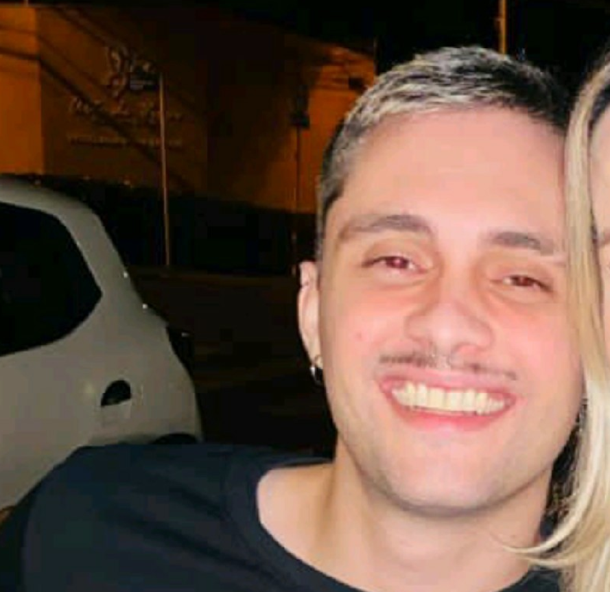

# Como é trabalhar na Fintech Neon: Amanda Segundo

*"A Neon me proporciona trabalhar com tecnologias de ponta e com pessoas incríveis"*

*Amanda Segundo*

Eu trabalhando remotamente, a Neon tem a cultura onde podemos trabalhar de qualquer lugar:

## O que é a Neon

A Neon é um instituição financeira ou fintech, termo criado a partir da junção dos termos "financial" (financeiro) e "technology" (tecnologia).

Sua missão é unir tecnologia e design para redesenhar e simplificar a experiência financeira das pessoas, além de ajudá-las a gerir melhor o próprio dinheiro.

Ela também foca nas classes menos favorecidas, facilitando o acesso à tecnologia e ao crédito.

💡[Mais sobre a Neon](https://neon.com.br/)

## LinkedIn

Meu primeiro contato com a Neon foi pelo LinkedIn, a recrutadora [Luana Vargas](https://www.linkedin.com/in/luana-vargas/) estava divulgando vagas, então mandei um convite para ela e ela em seguida já mandou mensagem e marcamos um entrevista.

A Luana:

💡 [A Luana também cria conteúdos sobre carreira no Instagram](https://www.instagram.com/luanavargas.rh/)

## Processo seletivo

Não demorou muito e já entrei no processo seletivo, foram várias provas, dentre os assuntos estavam Lógica de programação, Design de código e Arquitetura.

Também teve uma entrevista sobre o Fit Cultural, para ver se eu estava alinhada com a cultura e valores da empresa.

## Contratação

Também não demorou muito e recebi o resultado de que eu havia sido aprovada.

Quem me contratou foi o [Carlos Carvalho](https://www.linkedin.com/in/carlos-carvalho17/) que estudou do MIT - Massachusetts Institute of Technology e foi de Tech Manager a Diretor de Engenharia ne Neon.

Ele me escolheu para trabalhar em uma área chamada "Prevenção à Fraude, à Lavagem de Dinheiro e combate ao Terrorismo".

No ínicio fiquei assustada com o tema, não achei que iria ser escolhida para trabalhar com um assunto tão delicado, mas fiquei empolgada também.

O Carlos:

💡[O que é Fraude Bancária](https://pt.wikipedia.org/wiki/Fraude_banc%C3%A1ria)

💡[O que é Lavagem de dinheiro](https://pt.wikipedia.org/wiki/Lavagem_de_dinheiro)

💡[Série Ozark](https://pt.wikipedia.org/wiki/Ozark_(s%C3%A9rie_de_televis%C3%A3o))

## A área de Prevenção à Fraudes

Com um tempo as áreas se dividiram e fiquei apenas na de "Prevenção à fraudes".

### O que é Prevenção à Fraudes

É a área responsável por dectetar fraudes nas atividades bancárias, afim de impedir que os clientes e a própria instituição tenham prejuízos financeiros ou que afetem a imagem e a reputação da instituição.

### Projetos

Dentre os projetos estão o de Biometria Facial, Análise de transferências (PIX e TED) Análise de transações (Débito e Crédito) e Autenticação (Login).

Na Neon consumimos Engines e Inteligência Artifical para ajudar na detecção de fraudes.

Ilustração de uma Biometrial Facial (Fonte: Shutterstock):

💡 [Software Engine](https://en.wikipedia.org/wiki/Software_engine)

💡 [Inteligência Artificial](https://pt.wikipedia.org/wiki/Intelig%C3%AAncia_artificial)

### Equipe Multidisciplinar

A área de Prevenção à Fraudes é muito grande, trabalho com pessoas técnicas e de negócio.

Vou citar algumas pessoas que estão mais próximas a mim, que são referências anti-fraude, que são importantes na minha carreira e desenvolvimento.

### Tech Manager

O [Rogério Luis Alves](https://www.linkedin.com/in/rog%C3%A9rio-luis-alves-b9916521/) é um Tech Manager, e uma de suas responsabilidades é mediar a área técnica com a área de negócio.

### Product Manager

O [Luiz Carvalho](https://www.linkedin.com/in/luiz-carvalho-22a11b39/) é um Product Manager, ele é um especialista em negócio e é um anti-fraude há mais de vinte anos.

### Engenheiros de Software

#### Leonardo Cabbau

O [Leonardo](https://www.linkedin.com/in/leonardo-cabbau-50858b11b/) é uma referência em arquitetura de software.

#### Lucas Galvão Nunes

O [Lucas](https://www.linkedin.com/in/lucasgnunes/) é um Hacker Ético e gosta muito de assuntos relacinados a tokens.

#### Mateus Marques

O [Mateus](https://www.linkedin.com/in/marquesmateus/) tem um perfil de liderança e está a frente de projetos importantes como um engine.

### Anti-Fraud Manager

O [Joachim Valente](https://www.linkedin.com/in/joachim-valente-06968326/) é uma refência anti-fraud global, ele já trabalhou no Google e na Stripe.

## Valores culturais

## Comunidades techs dentro da Neon

## Mentoria entre mulheres

## Canal sobre pets
#fotosdepetparaquandobaterbadnotrabalho
